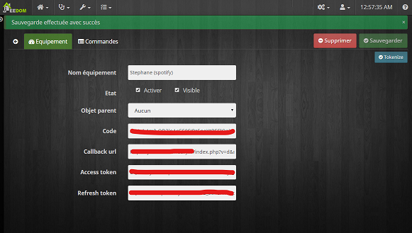
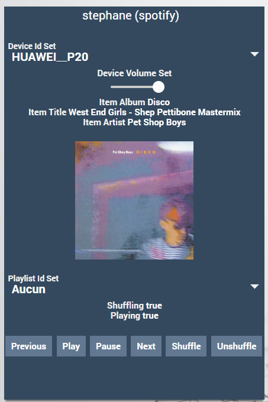

Présentation
===

Ce plugin permet de piloter vos tv philips depuis l'interface jeedom. Il s'appuie sur l'uilisation de l'.

Installation
===

Installer et activer le plugin.

Dépendances
===

Si vous souhaité utiliser le plugin avec une TV philips Android, l'API jointspace ne supporte pas la possibilité de basculer d'une source vidéo à l'autre (HDMI1 à HDMI6). Pour pouvoir utiliser cette fonction, il vous faudra alors installer les dépendnaces, ce qui aura pour action d'installer `android-tools-adb` itiliser pour l'activation des sources. Cette fonctionnalité est expérimentale et ne semble pas fonctionner avec toutes les TVs.

Configuration
===

Aucune configuration au niveau du plugin

Equipements
===

Ajouter un nouvel équipement en saisissant son nom et son adresse IP.

Si votre TV est sous Android TV (et uniquement dans ce cas), allumer votre TV et ensuite cliquer sur le bouton "Appairer". Le champ "Key" est alors automatiquement rensigné avec une clé.

Un message avec un code doit apparaitre sur votre TV, comme ci-dessous.

Recopier rapidement ce code dans le champ associé de l'équipement puis cliquer sur le bouton "Approuver".

Sauvegarder votre nouvel équipement.

Commandes
===

Chaque équipement dispose des commandes suivantes que vous pouvez rendre visible au viveau d'un widget.

Si vous voulez utiliser la selection des sources avec une TV android, il vous faudra activer le mode debug sur votre TV. Pour cela appuyer 7 fois de suite sur l'option "build" dans "Paramètres Android" > "A propos", puis dans le nouveau menu qui apparait dans les préférences, activer le mode debug.

Widget
===

Vous aurez alors un widget pour interragir avec votre TV et pourrez également utiliser les commandes dans vos scénarios.

Par défaut et afin de ne pas surcharger votre affichage, toutes les commandes ne sont pas visibles par défaut.

Pour aller plus loin
===

Penser à noter le plugin sur le market et faites part de vos remarques, demandes d'évolutions et bugs sur le forum [https://community.jeedom.com/tag/plugin-philips](https://community.jeedom.com/tag/plugin-philips)
