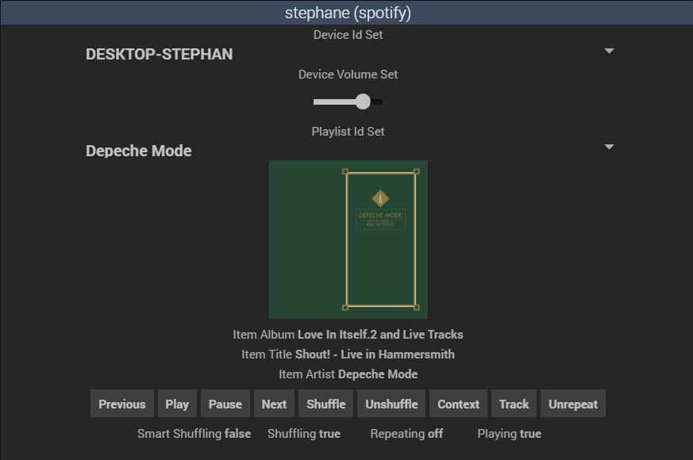

Description
===

Plugin pour piloter vos comptes spotify connect depuis l'interface jeedom.

Installation
===

Créer son compte developpeur spotify (https://developer.spotify.com/dashboard/).
 
Créer un client-id/client-secret ("Create a client id")

Récupérer votre client-id et client-secret.

Editer les propriétés ("Edit settings") en ajoutant https://[adresse]:[port]/index.php?v=d&m=spotify&p=spotify ou http://[adresse]:[port]/index.php?v=d&m=spotify&p=spotify en fonction de votre installation jeedom, puis sauvegarder.

Configuration
===

Ajouter un nouvel equipement pour le plugin Spotify.

Coller votre client-id et votre client-secret que vous avez récupéré sur votre compte Spotify.

Cliquer sur le bouton tokenize, saisir votre login/password et approuver.

Les champs Token Expire, Access et Refresh sont automatiquement remplis et il ne vous reste qu'à sauvegarder.

Démarrer ou redémarrer le daemon du plugin.

Cast
===

Si vous souhaitez utiliser des devices compatibles cast v2, vous pouvez déclarer vos device castv2 sous la forme <code>192.168.1.214=chrome-cast-1&#124;192.168.1.111=chrome-cast-2</code>, depuis la page de configuration du plugin, en veillant à bien utiliser le même nom que le nom réseau de l'équipement.

Pour utiliser ces devices à partir d'un équipement, il vous faudra récupérer le cookie sur la version web de Spotify, en vous connectant sur le lecteur web de Spotify, en ouvrant l'interface de développement de votre navigateur (touche F12), puis en allant dans Applications pour récupérer vos cookies sp_dc et sp_key. Recopier le cookie (sp_dc et sp_key) dans les champs de la section cookie de votre équipement et sauvegarder.

Utilisation
===

Pour chaque equipement activé vous aurez un widget sur votre Dashboard.
 
Chaque équipement dispose des commandes réparties dans les catégories suivantes:

- Item : "morceau en cours"

	- Item Id **(info)** : clé interne spotifiy du morceau en cours

	- Item Title **(info)** : titre du morceau en cours

	- Item Artist **(info)** : nom de l'artiste du morceau en cours

	- Item Album **(info)** : album du morceau en cours

	- Item Image **(info)** : url de l'image principale du morceau en cours

	- Playing **(info)** : *true* si la lecture est en cours, *false* sinon

	- Play **(action)** : lecture (attention, ne fonctionne que lorsqu'un device est actif)

	- Pause **(action)** : supend la lecture, lorsque la lecture est en cours
	
	- Previous **(action)** : retourne au morceau précédent

	- Next **(action)** : passe au morceau suivant

	- Shuffling **(info)** : *true* si la lecture aléatoire est activés, *false* sinon

	- Shuffle **(action)** : active la lecture aléatoire

	- Unshuffle **(action)** : désactive la lecture aléatoire

- Device : "player actif"

	- Device Is Active **(info)** : *true* si un player est actif, *false* sinon

	- Device Id **(info)** : clé interne spotifiy du player 

	- Device Name **(info)** : nom du player

	- Device Id Set **(action)** : selectionne un device à partir de la clé interne spotify passée dans le paramètre 'select' (utilisé en liste déroulante dans le widget)	 

	- Device Name Set **(action)** : selectionne un device à partir du libéllé passé en paramètre dans le paramètre 'title' ou 'message'

	- Device Volume	**(info)** : volume du player (de 0 à 100)

	- Device Volume Set **(action)** : positionne le volume passé en paramètre dans le paramètre 'title' ou 'message' (valeur de 0 à 100)

- Playlist : "playlist en cours"

	- Playlist Id **(info)** : clé interne spotify de la playlist en cours
	
	- Playlist Name	**(info)** : libellé de la playlist en cours

	- Playlist Id Set **(action)** : selectionne une playlist à partir de la clé interne spotify passée dans le paramètre 'select' (utilisé en liste déroulante dans le widget)	 
	 
	- Playlist Name Set	**(action)** : selectionne une playlist à partir du libéllé passé en paramètre dans le paramètre 'title' ou 'message'

Pour aller plus loin
===

Penser à noter le plugin sur le market et faites part de vos remarques, demandes d'évolutions et bugs sur le forum [https://community.jeedom.com/tag/plugin-spotify](https://community.jeedom.com/tag/plugin-spotify)
